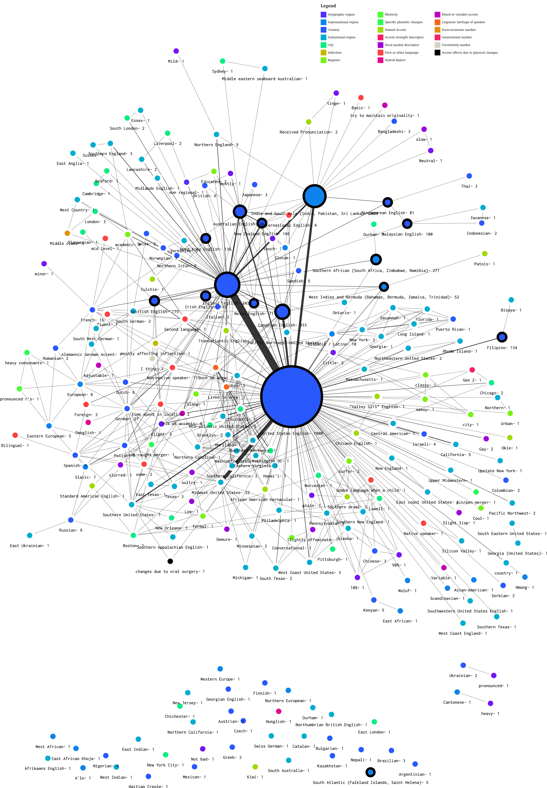
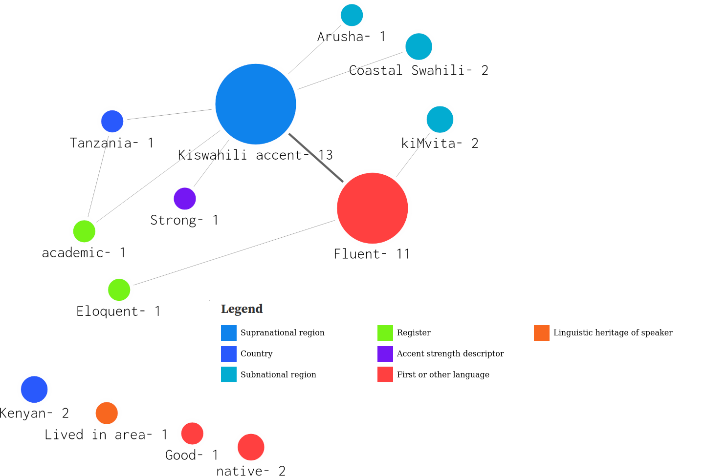

# Common Voice Accent Taxonomy Tool - System description

## Overview and rationale

The [Mozilla Common Voice project](https://commonvoice.mozilla.org) is the world's largest open source voice data project. From around 2019, data contributors to Common Voice have been able to specify an accent in their Profile data. However, the accents they could select from were constrained to an enumerated list. In early 2022, the Profile user interface was changed to allow data contributors to self-specify accents. 

However, this change presents challenges to ML practitioners and those using accent data for downstream applications. Firstly, the accent data is free text which is comma delimited. However, the contributor-specified accent descriptors may also contain commas, requiring the use of regular expressions to separate accent descriptors accurately. Secondly, because the accent data is contributor-specified, there is no restrictive taxonomy. 

Contributors may specify accents without the use of a constraining taxonomy - for example "Midwestern United States English", "Midwest", "Midwestern, and "Midwestern United States" all represent the _same_ accent descriptor. This necessitated a set of heuristics to merge identical descriptors. Thirdly, contributors may specify accent descriptors that are compounds. For example, "heavy Cantonese" actually contains two descriptors - "heavy" to indicate accent strength, and "Cantonese" as a geographical regional marker.

This problem is significant due to the large number of actors who consume the Common Voice datasets; it is widely used in other datasets such as People's Speech (Galvez, D., Diamos, G., Ciro, J., Cerón, J. F., Achorn, K., Gopi, A., & Reddi, V. J. (2021). The People's Speech: A Large-Scale Diverse English Speech Recognition Dataset for Commercial Usage. arXiv preprint arXiv:2111.09344.), and is used as an evaluation dataset for large automatic speech recognition toolsets such as Whisper (Radford, A., Kim, J. W., Xu, T., Brockman, G., McLeavey, C., & Sutskever, I. (2022). Robust speech recognition via large-scale weak supervision. arXiv preprint arXiv:2212.04356.). Tooling is needed to be able to work with free-text accent data, across the 100+ languages available in Common Voice. 

## System components 

The tools here include: 

* `cvaccents.py` - a set of Python classes to represent `Accent`, `AccentCollection` and `AccentDescriptor`
* `cvaccents-v{Mozilla CV dataset version}-{(optional) language}` -  Jupyter notebook that provides a worked example of extracting AccentDescriptor information and applying heuristics with `cyvaccents.py`. This notebook _also_ creates nodes and edges `JSON` files suitable for data visualisation in network diagrams.
* Data visualisations are provided [as shown here for English](https://observablehq.com/@kathyreid/phd-mozilla-cv-accent-relationships-v13) and for [Kiswahili](https://observablehq.com/@kathyreid/phd-mozilla-cv-accent-relationships-v13-sw). 

## Limitations and challenges 

* The Common Voice English dataset is very large; we were fortunate enough to have access to a GPU cluster to run the Jupyter notebook, but the dataset is so large that it will likely stretch the limits of a single machine. 

## Ethical considerations 

* Ethical considerations of this work are detailed in our accompanying paper.

## Future developments 

* This taxonomy was developed from an English dataset, and we have applied it to Kiswahili. We invite other researchers and practitioners to apply it to other languages to validate its utility; or amend it as needed for other languages.

* This taxonomy has not been used to empirically assess voice datasets or models for bias; we anticipate doing this in future work. 

## Accent taxonomy provided for English 

The `cvaccents-v13.ipynb` notebook provides the following taxonomy of Accent Descriptors. Practitioners may wish to extend this taxonomy for their own purposes, or may use this taxonomy as a structure with which to assess voice datasets or models for _accent bias_. 

| Taxonomic category | Count |
|--------------------:|:-------|
| Geographic descriptors | |
|   - Supranational region | 20 |
|   - Country | 50 |
|   - Subnational region | 76 |
|   - City | 20 |
|   - Other | 1 | 
| Register | 12 | 
| First or other language marker | 13 | 
| Accent strength descriptor | 14 | 
| Phonetic descriptors | |
|   - Specific phonetic changes | 3 |
|   - Rhoticity | 1 | 
|   - Inflection | 1 | 
| Vocal quality descriptor | 10 | 
| Mixed or variable accent | 4 | 
| Uncertainty marker | 1 | 
| Accent effects due to physical change | 1 |

### Visualisation of accent relationships in English 



### Visualisation of accent relationships in Kiswahili 



### Instructions for use 

1. [Fork this repo](https://github.com/KathyReid/cv-analysis-for-bias/fork) under your own GitHub username, or clone this repo into your environment with the command: 
`git clone https://github.com/KathyReid/cv-analysis-for-bias`

2. Use your environment's instructions and create a virtual environment. This will be: ```python3 -m venv [directory]``` if you use `pip` but will differ if you use `conda`. 

3. Activate your virtual environment. If you use `pip` this will be: 

```
cd [directory]
source /bin/activate 
``` 

4. Install the required packages. If you use `pip` the commaned is: ```python3 -m pip install -r requirements.txt``` but will differ if you use `conda`. 

5. Launch Jupyter 

```
jupyter notebook 
```
6. You can then use the notebook from within the Jupyter environment. 

## Citing this toolset 

```
@Booklet{EasyChair:9678,
  author = {Kathy Reid and Elizabeth T. Williams},
  title = {Common Voice and Accent Choice: Data Contributors Self-Describe Their Spoken Accents in Diverse Ways},
  howpublished = {EasyChair Preprint no. 9678},

  year = {EasyChair, 2023}}

```

[https://easychair.org/publications/preprint/gFLz](https://easychair.org/publications/preprint/gFLz)

## License 

These tools use the Mozilla Public License (MPL) to align with Mozilla's broader ecosystem.

## Change Log 

### 0.1 Initial release using v.11 of the Mozilla Common Voice `en` dataset

* 16 categories identified 
* 164 individual accents identified 
* 297 relationships between accents identified 

[Related data visualisation on the Observable platform](https://observablehq.com/@kathyreid/phd-mozilla-cv-accent-relationships)

### 0.2 Updated for v.13 of the Mozilla Common Voice `en` dataset

The key changes in this version are: 

* The number of categories identified in the data have increased from 16 in the first version, to 20 in this one. The four additional categories are:
  - _Linguistic heritage of speaker_ - indicating the speaker's language acquisition or immersion heritage, such as time spent in a location, or being born or raised in a location.
  - _Socio-economic marker_ - indicating a speaker's association with a socio-economic group or class, such as Middle Class. 
  - _Hybrid dialect - indicating the speaker speaks using a dialect where two languages have come into contact_ - such as Denglish (German - Deutsch - and English) and Hinglish (Hindi and English, spoken in India).
  - _Generational marker_ - indicating the speaker's association with a generation, belying their age range, such as Gen Z.

* The number of individual accents identified has increased from 164 in the first version, to 235 in this one.
* The number of relationships between individual accents, which indicate a co-occurrence between speaker-described accents, such as "German" and "England English", has increased from 297 in the first version, to 515 in this one.

